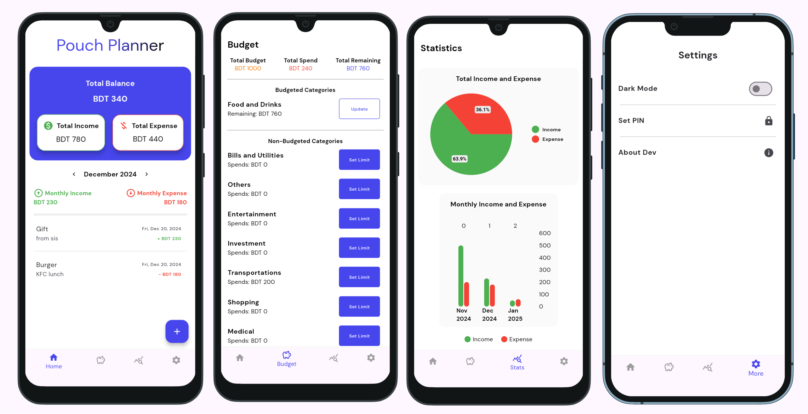
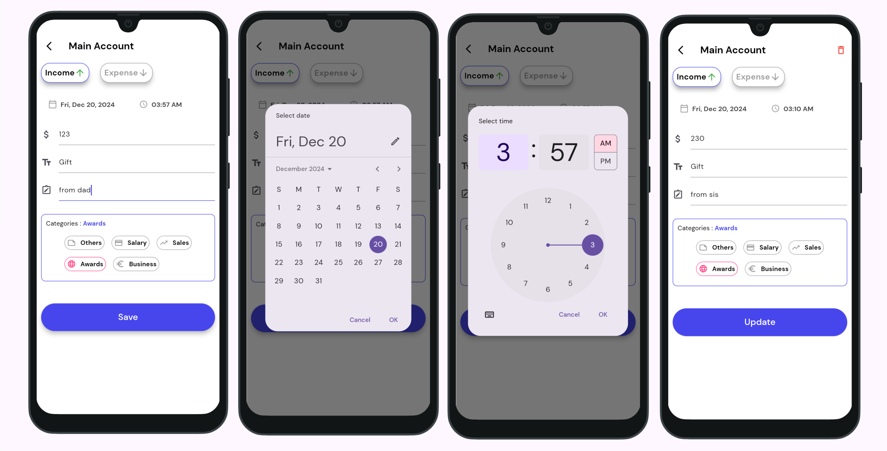
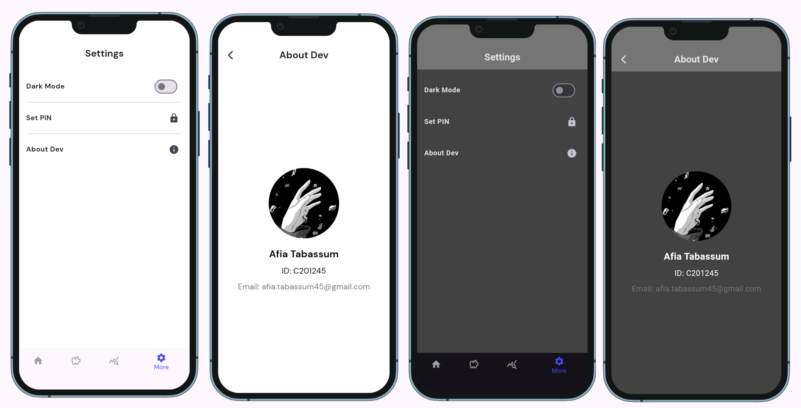

# Pouch Planner - An Expense Tracker App


Pouch Planner is an intuitive expense tracker app designed to help users manage and monitor their finances. The app provides essential features like setting a budget, viewing statistics, and managing various expenses through an easy-to-use interface. It also offers a smooth navigation experience with a bottom navigation bar for quick access to different app sections, including the Home page, Budget page, Statistics page, Settings page, and a Splash Screen on startup.
<br />
<br />

> [!NOTE]
> This app was made in order to submit it as a final project for my Mobile App Development Course organized by EDGE Digital Training Skills for Students Program, IIUC, to my Instructor Noor Mohammed Anik Sir, Batch CBI-018.

<!--```diff
@@ This app was made in order to submit it as a final project for my Mobile App Development Course organized by EDGE Digital Training Skills for Students Program, IIUC, to my Instructor Noor Mohammed Anik Sir, Batch CBI-018. @@
```-->
## Features

- **Splash Screen**: Displays an animated logo that grows and shrinks during app startup.
- **Home Page**: Displays an overview of user expenses and financial summary.
- **Add/Update Page**: Allows users to add their expenses or income according to selected Date & Time.
- **Budget Page**: Allows users to set and track their monthly or yearly budgets.
- **Statistics Page**: Visual representation of user expense data, including charts and graphs.
- **Settings Page**: Provides options for managing dark mode, PIN security, and developer information.
- **Bottom Navigation Bar**: Seamless navigation between the app’s main pages.

## Screenshots





### Languages, tools, framework & Database
- Dart
- Android Studio/VS Code
- Flutter
- Hive (lightweight NoSQL database)

## Project Setup

Follow the steps below to set up and run this project locally:

### Prerequisites

- [Flutter](https://flutter.dev/docs/get-started/install) (version 2.0 or higher)
- [Dart](https://dart.dev/get-dart)
- A suitable IDE (e.g., [VS Code](https://code.visualstudio.com/) or [Android Studio](https://developer.android.com/studio))

### Dependencies
*dependencies*
-  provider - A state management solution for managing and listening to app state changes.
-  pie_chart - A widget library for creating visually appealing pie charts.
-  intl - Provides internationalization and localization utilities, including date and number formatting.
-  shared_preferences - Stores simple key-value pairs locally on the device for persistent user settings.
-  hive - A lightweight and fast NoSQL database for local data storage.
-  hive_flutter - Hive integration with Flutter for seamless database usage.
-  device_preview - Enables testing and previewing the app on different devices and screen sizes.
-  fl_chart - A chart library for creating beautiful and customizable charts, such as line and bar graphs.


*dev_dependencies:*
-  hive_generator - Generates Hive type adapters for custom objects automatically.
-  build_runner -  A code generation tool used to generate files, such as Hive type adapters, at build time.

### Clone the Repository

```bash
git clone https://github.com/afia45/expense_tracker_app_local_db.git
cd expense_tracker_app_local_db
flutter pub get
flutter run
```

## 🔗 Screen Recordings

- [App Screen Recording](https://drive.google.com/file/d/11rtwWQE3fnGO07l7elz-ZVp94QnLo840/view?usp=sharing)

## 🔗 Presentation Slide
- [Presentation Slide](asset/Pouch_Planner.pdf)


